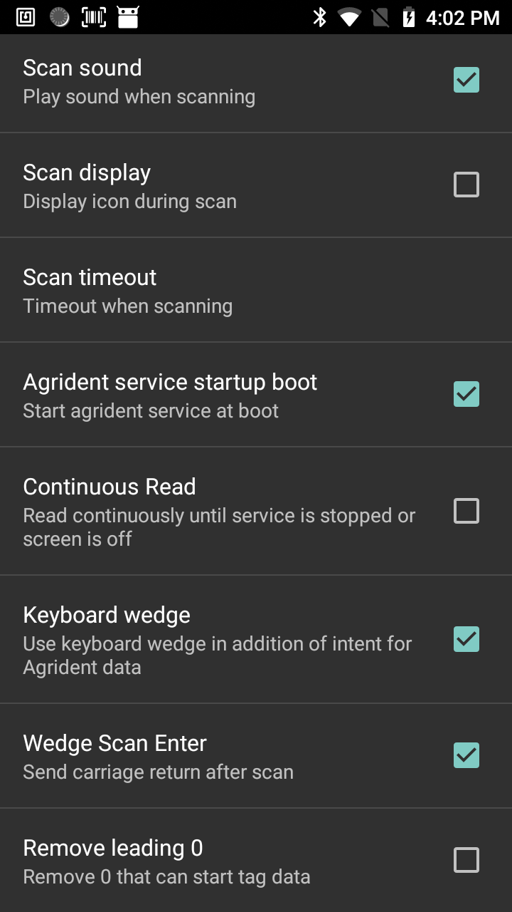

Agrident Wedge
=====

Introduction
------------
This application demonstrates how to use the Agrident Wedge application on a C-One² with LF Agrident RFID reader.
The application is composed of two parts:

 - Agrident Wedge Settings (AW Settings)
 - Agrident Wedge Scan (AW Scan)

Prerequisites
-------------
### C-One² iCLass

 - CoreServices version 1.9.0 and above must be installed on the device.

What is a keyboard wedge?
-------------------------

A keyboard wedge is an application that can acquire data and send it directly in the keyboard buffer, just as if it was typed on a virtual keyboard.

Coppernic's wedge applications add a deeper integration capability by using Android intent in order to send reader's events (successful read or read failure).

Agrident settings
--------------
Agrident Settings allows confuring wedge for the Sound, Timeout and so on...

 - Scan Sound: plays a sound after a good or bad read.
 - Scan Display: displays an icon while reader is scanning.
 - Scan Timeout: allows setting time in seconds while the device is trying to read a tag.
 - Agrident Service startup boot: when enabled, the service will start automatically when the device boots.
 - Continuous Read : read continuously untils service is stopped or screen turns off.
 - Keyboard Wedge : when enabled, it will send result to the keyboard buffer. It is still broadcasting Intents.
 - Scan Enter: adds a carriage return of the data read in keyboard buffer.
 - Remove leading 0: Remove 0 from the first data sent.

Agrident Wedge Scan
---------
 This application just start a scan to read an LF tag.
 You can use it remapping this application to on (or more) of the 3 programmable button. You can do it on the device in Settings > Remap key & shortcut.
