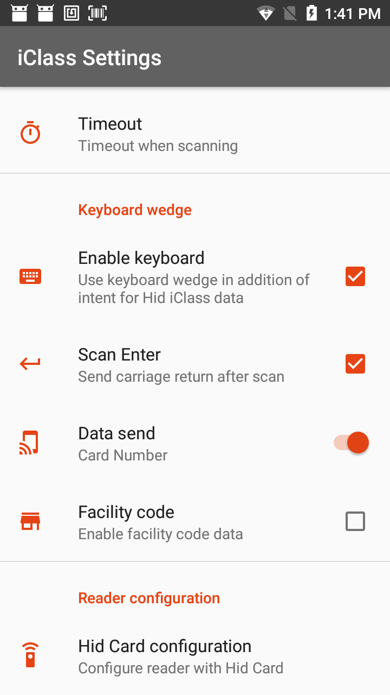

HID iClass Wedge
=====


Introduction
------------
This application demonstrates how to use the HID iClass/LFProx Wedge application on a C-One with Hid/LFProx RFID reader.
The application is composed of two parts:

 - iClass Settings
 - iClass Scan


Prerequisites
-------------
### C-One² iCLass

 - CoreServices version 1.9.0 and above must be installed on the device.

What is a keyboard wedge?
-------------------------

A keyboard wedge is an application that can acquire data and send it directly in the keyboard buffer, just as if it was typed on a virtual keyboard.

Coppernic's wedge applications add a deeper integration capability by using Android intent in order to send reader's events (successful read or read failure).


iCLass settings
--------------
iCLass Settings allows confuring wedge for the Sound, Timeout and so on...
Settings screen is composed of four sections :
  - Service
  - Scan
  - Keyboard wedge
  - Reader Configuration


 


1.Service
   - Enable service : you can start or stop the service with this option.
   - Hid iClass Service startup boot : when it is enabled, the service will start
   automatically when the device boot.
   - On/off reader for each scan : when enabled, it will power off reader after scanning
   (either for bad or good read). It will save battery, but can be a little bit longer
   to read as you will need to power on the reader every time.


 2.Scan
  - Sound : play a sound after a good or bad scan.
  - Display : display an icon while scanning.
  - Timeout : allow setting time in seconds while the device is trying to read a tag.


 3.Keyboard Wedge
  - Enable Keyboard : when enabled, it will send result to the keyboard buffer. It is still broadcasting Intents.
  - Scan Enter : add a carriage return of the data reader.
  - Data Send : you can choose either between card number and facility code to send to the keyboard buffer.
  - Facility code : depending on the card you want to read, card number will be different if card has a facility code or not.


  4.Reader configuration
   - Hid Card configuration : allows using an HID card configuration. You need to present and hold the card front of the antenna until the configuration is finished.


iClass scan
---------
 This application just start a scan to read an iClass/LF prox card.
 You can use it remapping this application to on (or more) of the 3 programmable button. You can do it on the device in Settings > Remap key & shortcut.


Using iClass Wedge with intents in your application
---------------------------------

- For this example, Coppernic Core library is used. You must declare it in build.gradle.

``` groovy
// At project level
allprojects {
    repositories {
        google()
        jcenter()
        maven { url "https://artifactory.coppernic.fr/artifactory/libs-release" }
    }
}
```

``` groovy
// At module level
implementation 'fr.coppernic.sdk.core:CpcCore:1.9.1'
```


- Declare a broadcast receiver in your class, it will receive the intents from the iClass Wedge application.

``` java
private BroadcastReceiver iClassReceiver = new BroadcastReceiver() {
    @Override
    public void onReceive(Context context, Intent intent) {        
        if (intent.getAction().equals(Defines.IntentDefines.ACTION_HID_ICLASS_SUCCESS)) {
            //All data received by the reader without any parsing
            Byte[] data = intent.getByteArrayExtra(Defines.Keys.KEY_HID_ICLASS_DATA_BYTES)
            String cardNumber = intent.getStringExtra(Defines.Keys.KEY_HID_ICLASS_DATA_CARD_NUMBER);  
            String companyCode = intent.getStringExtra(Defines.Keys.KEY_HID_ICLASS_DATA_COMPANY_CODE);  
            String facilityCode = intent.getStringExtra(Defines.Keys.KEY_HID_ICLASS_DATA_FACILITY_CODE);  
            String pacs = intent.getStringExtra(Defines.Keys.KEY_HID_ICLASS_DATA_PACS);
            //CArd type : HF or LF
            String cardType = intent.getStringExtra(Defines.Keys.KEY_HID_ICLASS_DATA_TYPE);                  
        } else if (intent.getAction().equals(Defines.IntentDefines.ACTION_HID_ICLASS_ERROR)) {
            // Read failed (main cause is timeout)
        }
    }
};
```

- Register the receiver, for example in onStart

``` java
@Override
protected void onStart() {
    super.onStart();
    // Registers iClass wedge intent receiver
    IntentFilter intentFilter = new IntentFilter();
    intentFilter.addAction(Defines.IntentDefines.ACTION_HID_ICLASS_SUCCESS);
    intentFilter.addAction(Defines.IntentDefines.ACTION_HID_ICLASS_ERROR);
    registerReceiver(iClassReceiver, intentFilter);
}    
```

- And unregister it, in onStop for example

``` java
@Override
protected void onStop() {
    // Unregisters iClass wedge receiver
    unregisterReceiver(iClassReceiver);
    super.onStop();
}
```

- Trig a read

```java

// Starts Hid iClass wedge
Intent sendIntent = new Intent();
sendIntent.setPackage(BuildConfig.APPLICATION_ID);
sendIntent.setAction(Defines.IntentDefines.ACTION_HID_ICLASS_SCAN);
if (Build.VERSION.SDK_INT >= Build.VERSION_CODES.O) {
    startForegroundService(intent);
} else {
    startService(intent);
}
```

if you don't want to declare CpcCore in your build, then here are
string values :

```java
//Hid Iclass
public static final String ACTION_HID_ICLASS_SUCCESS = "fr.coppernic.intent.hid.iclasssuccess";
public static final String ACTION_HID_ICLASS_ERROR = "fr.coppernic.intent.hid.iclassfailed";
public static final String ACTION_HID_ICLASS_SERVICE_STOP = "fr.coppernic.intent.action.stop.hid.iclass.service";
public static final String ACTION_HID_ICLASS_SERVICE_START = "fr.coppernic.intent.action.start.hid.iclass.service";
public static final String ACTION_HID_ICLASS_SCAN = "fr.coppernic.intent.action.hid.iclass.SCAN";

public static final String KEY_HID_ICLASS_DATA_BYTES = "HidIclassDataBytes";
public static final String KEY_HID_ICLASS_DATA_CARD_NUMBER = "HidIclassDataCardNumber";
public static final String KEY_HID_ICLASS_DATA_COMPANY_CODE = "HidIclassDataCompanyCode";
public static final String KEY_HID_ICLASS_DATA_FACILITY_CODE = "HidIclassDataFacilityCode";
public static final String KEY_HID_ICLASS_DATA_PACS = "HidIclassDataPacs";
public static final String KEY_HID_ICLASS_DATA_TYPE = "HidIclassDataType";
public static final String KEY_HID_ICLASS_DATA_ERROR_MESSAGE = "HidIclassDataErrorMessage";
```
