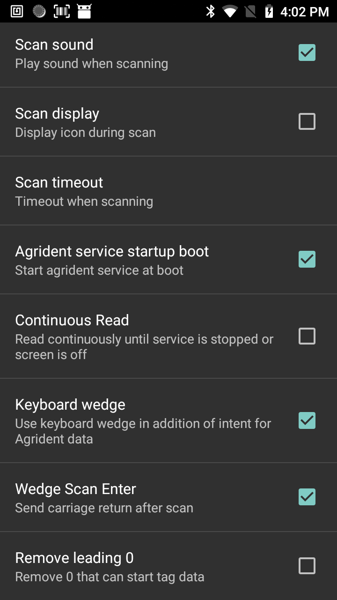

Agrident Wedge
=====


Introduction
------------
Cette application explique comment utiliser l'application Agrident Wedge sur un C-One² disposant d'un lecteur RFID LF Agrident.
L'application est composée de deux parties:
 - Agrident Wedge Settings (AW Settings)
 - Agrident Wedge Scan (AW Scan) 


Prérequis
---------
### C-One² LF Agrident

 - CoreServices version 1.9.0 et supérieure doit être installée sur le terminal.
 - Agrident Wedge 2.2.0 et supérieure doit être installée sur le terminal.

 Les application sont disponibles sur [F-Droid](www.coppernic.fr/fdroid.apk).

Qu'est ce qu'un keyboard wedge?
-------------------------------

Une application keyboard wedge est une application qui récupère des données et qui les envoient directement dans la zone tampon du clavier, comme si elles avaient été tapées sur un clavier virtuel.

Les applications Coppernic de type wedge offrent une meilleure intégration grâce à l'utilisation d'intent Android à la place d'évenements du lecteur.(lecture réussie ou non)


Paramètres Agrident 
-------------------

Les paramètres d'Agrident Wedge permettent la configuration du son, des délais, et bien d'autres...




 - Scan Sound: joue un son après une lecture réussie ou non.
 - Scan Display: affiche une icône durant le scan du lecteur.
 - Scan Timeout: paramètre la durée pendant laquelle le lecteur va essayer de lire un tag.
 - Agrident Service startup boot: si activé, le service va ce lancer automatiquement au démarrage du terminal.
 - Continuous Read: le lecteur va lire en permanence jusqu'à ce que le service soit stoppé ou l'écran éteind.
 - Keyboard Wedge: si activé, envoie le résultat au tampon du clavier. Il diffuse toujours des intentions.
 - Scan Enter: ajoute un retour chariot dans le tampon du clavier aux données lues.
 - Remove leading 0: supprime 0 aux premières données envoyées.


 Scanne Agrident Wedge
 ---------------------
 Cette application lance un scan pour lire un tag LF.
 Vous pouvez utiliser cette application en l'associant avec un (ou plus) bouton programmable. Vous pouvez effectuer cette opération sur le terminal dans Paramètres -> Remap key & shorcut.


 Utiliser Agrident Wedge comme un clavier
 ----------------------------------------
 - Associer l'application Agrident Wedge avec un (ou plus) bouton programmable du C-One.
 - Appuyer sur le bouton.
 - Les données sont envoyées au système comme des entrées clavier.


 Utiliser Agrident Wedge avec des Intents.
 -----------------------------------------

 - Pour cet exemple, la librairie utilitaire de Coppernic est utilisée. Vous devez la déclarer dans votre build.gradle:

 ``` groovy
 // Au niveau du projet
 allprojects {
     repositories {
         google()
         jcenter()
         maven { url "https://artifactory.coppernic.fr/artifactory/libs-release" }
     }
 }
 ```

 ``` groovy
 // Au niveau du module
 implementation(group: 'fr.coppernic.sdk.cpcutils', name: 'CpcUtilsLib', version: '6.13.0', ext: 'aar')
 ```


 - Déclarer un broadcast receiver dans votre class, il recevra les intents en provenance de l'application Agrident Wedge.

 ``` java
 private BroadcastReceiver agridentReceiver = new BroadcastReceiver() {
     @Override
     public void onReceive(Context context, Intent intent) {        
         if (intent.getAction().equals(CpcDefinitions.ACTION_AGRIDENT_SUCCESS)) {
             // Data is available as a String
             String dataRead = intent.getStringExtra(CpcDefinitions.KEY_BARCODE_DATA);           
         } else if (intent.getAction().equals(CpcDefinitions.ACTION_AGRIDENT_ERROR)) {
             // Read failed (main cause is timeout)
         }
     }
 };
 ```

 - Enregister le receiver, par exemple dans le onStart

 ``` java
 @Override
 protected void onStart() {
     super.onStart();
     // Registers agrident wedge intent receiver
     IntentFilter intentFilter = new IntentFilter();
     intentFilter.addAction(CpcDefinitions.ACTION_AGRIDENT_SUCCESS);
     intentFilter.addAction(CpcDefinitions.ACTION_AGRIDENT_ERROR);
     registerReceiver(agridentReceiver, intentFilter);
 }
 ```

 - Et désenregister le, dans le onStop par exemple:

 ``` java
 @Override
 protected void onStop() {
     // Unregisters agrident wedge receiver
     unregisterReceiver(agridentReceiver);
     super.onStop();
 }
 ```

 - Déclencher une lecture:

 ```java
 private static final String AGRIDENT_WEDGE = "fr.coppernic.tools.cpcagridentwedge";

 // Starts Agrident wedge
 Intent launchIntent = getPackageManager().getLaunchIntentForPackage(AGRIDENT_WEDGE);
 if (launchIntent != null) {
     startActivity(launchIntent);//null pointer check in case package name was not found
 }
 ```

 Si vous ne voulez pas déclarer CpcUtilsLib dans votre application, voici les valeurs au format string:

 ```java
 public static final String ACTION_AGRIDENT_SUCCESS = "fr.coppernic.intent.agridentsuccess";
 public static final String ACTION_AGRIDENT_ERROR = "fr.coppernic.intent.agridentfailed";
 public static final String ACTION_AGRIDENT_SERVICE_STOP = "fr.coppernic.intent.action.stop.agrident.service";
 public static final String ACTION_AGRIDENT_SERVICE_START = "fr.coppernic.intent.action.start.agrident.service";
 public static final String ACTION_AGRIDENT_READ = "fr.coppernic.tools.agrident.wedge.READ";
 public static final String KEY_BARCODE_DATA = "BarcodeData";
 ```
