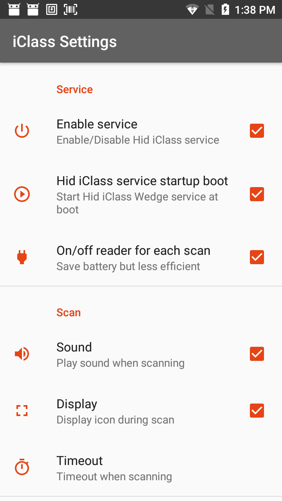
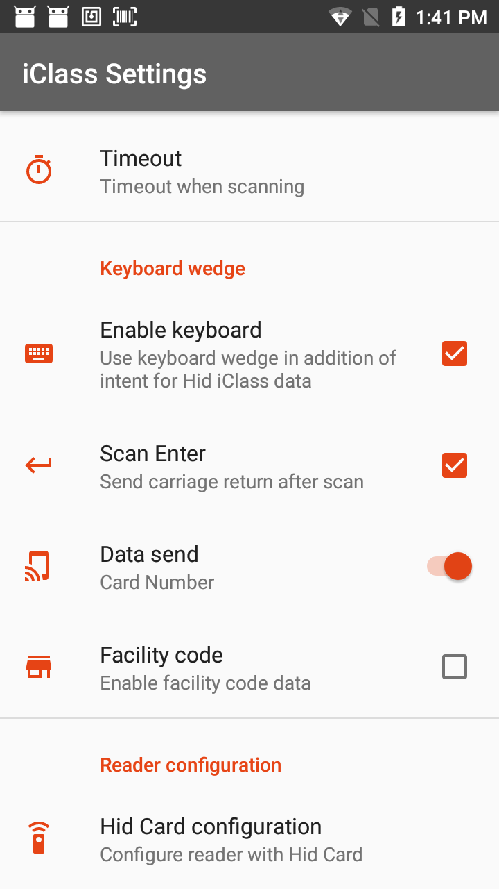

HID iClass Wedge
================


Introduction
------------

Cette application montre comment utiliser le lecteur HID iClass/LF Prox Wedge sur un C-One² disposant d'un lecteur RFID HID iClass/LF Prox .
L'application est composée de deux parties:

 - iClass Settings,
 - iClass Scan.


Prérequis
---------

### C-One² iClass

 - CoreServices à la version version 1.9.0 ou supérieure doit être installée sur le terminal.

Qu'est ce qu'un keyboard wedge?
-------------------------------

Une application keyboard wedge est une application qui récupère des données du lecteur et qui les envoie directement dans la zone tampon du clavier, comme si elles avaient été tapées sur un clavier virtuel. Elle sont ensuite insérées automatiquement dans les champs de texte par le système Android.

Les applications Coppernic de type wedge offrent une meilleure intégration grâce à l'utilisation d'`Intent` Android en plus des données insérées dans le buffer du clavier. On peut ainsi savoir si la lecture a réussie ou non, récupérer le code d'erreur ou tout simplement récupérer les données du lecteur de manière beaucoup plus réactive. Ces données peuvent être traité par l'application avant affichage à l'opérateur.


Paramètres iCLass
-----------------

Les paramètres d'HID iClass Wedge permettent la configuration du son, des délais, et bien d'autres...
L'écran de paramètres est composé de 4 sections :
  - Service
  - Scan
  - Keyboard wedge
  - Reader Configuration


 


 1.Service
   - **Enable service** : Démarre ou arrête le service.
   - **Hid iClass Service startup boot** : Permet d'activer le lancement du service au démarrage du terminal.
   - **On/off reader for each scan** : si activé, le lecteur s'éteindra après une lecture.(qu'elle soit réussie ou non).
Économise la batterie, mais peut augmenter le temps de lecture car le lecteur doit démarrer à chaque fois.


 2.Scan
  - **Sound** : joue un son après une lecture réussie ou non.
  - **Display** : affiche une icône durant le scan du lecteur.
  - **Timeout** : paramètre la durée pendant laquelle le lecteur va essayer de lire un tag.


 3.Keyboard Wedge
  - **Enable Keyboard** : si activé, envoie le résultat au tampon du clavier. Il diffuse toujours des `Intent`.
  - **Scan Enter** : ajoute un retour chariot aux données lues par la lecture.
  - **Data Send** : vous pouvez choisir entre le numéro de carte et le `Facility code` à envoyer au clavier.
  - **Facility code** : dépend de la carte que vous voulez lire, le numéro de carte sera différent si la carte à un `Facility code` ou non.


 4.Reader configuration
   - Hid Card configuration : permet l'utilisation d'une carte de configuration HID. Vous devez présenter la carte devant l'antenne
 et la maintenir jusqu'à ce que la configuration soit finie.


iClass scan
-----------

 Cette application lance un scan pour lire une carte iClass/LF prox.
 Vous pouvez utiliser cette application en l'associant avec un (ou plusieurs) bouton programmable. Vous pouvez
 effectuer cette opération sur le terminal dans Paramètres -> Remap key & shorcut.


Utiliser iClass Wedge avec intents dans votre application
---------------------------------------------------------

- Pour cet exemple, la bibliothèqe CpcCore de Coppernic est utilisée. Vous devez la déclarer dans votre build.gradle.

``` groovy
// Au niveau du projet
allprojects {
    repositories {
        google()
        jcenter()
        maven { url "https://artifactory.coppernic.fr/artifactory/libs-release" }
    }
}
```

``` groovy
// Au niveau du module
implementation 'fr.coppernic.sdk.core:CpcCore:1.11.1'
```


- Déclarer un `BroadcastReceiver` dans votre classe, il recevra les `Intent` en provenance de l'application iClass Wedge.

``` java
private BroadcastReceiver iClassReceiver = new BroadcastReceiver() {
    @Override
    public void onReceive(Context context, Intent intent) {        
        if (intent.getAction().equals(Defines.IntentDefines.ACTION_HID_ICLASS_SUCCESS)) {
            //All data received by the reader without any parsing
            Byte[] data = intent.getByteArrayExtra(Defines.Keys.KEY_HID_ICLASS_DATA_BYTES)
            String cardNumber = intent.getStringExtra(Defines.Keys.KEY_HID_ICLASS_DATA_CARD_NUMBER);  
            String companyCode = intent.getStringExtra(Defines.Keys.KEY_HID_ICLASS_DATA_COMPANY_CODE);  
            String facilityCode = intent.getStringExtra(Defines.Keys.KEY_HID_ICLASS_DATA_FACILITY_CODE);  
            String pacs = intent.getStringExtra(Defines.Keys.KEY_HID_ICLASS_DATA_PACS);
            //CArd type : HF or LF
            String cardType = intent.getStringExtra(Defines.Keys.KEY_HID_ICLASS_DATA_TYPE);                  
        } else if (intent.getAction().equals(Defines.IntentDefines.ACTION_HID_ICLASS_ERROR)) {
            // Read failed (main cause is timeout)
        }
    }
};
```

- Enregistrer le `BroadcastReceiver`, par exemple dans la méthode `onStart()`:

``` java
@Override
protected void onStart() {
    super.onStart();
    // Registers iClass wedge intent receiver
    IntentFilter intentFilter = new IntentFilter();
    intentFilter.addAction(Defines.IntentDefines.ACTION_HID_ICLASS_SUCCESS);
    intentFilter.addAction(Defines.IntentDefines.ACTION_HID_ICLASS_ERROR);
    registerReceiver(iClassReceiver, intentFilter);
}    
```

- et le désincrire, dans la méthode `onStop()` par exemple:

``` java
@Override
protected void onStop() {
    // Unregisters iClass wedge receiver
    unregisterReceiver(iClassReceiver);
    super.onStop();
}
```

- Déclencher une lecture:

```java

// Starts Hid iClass wedge
Intent sendIntent = new Intent();
sendIntent.setPackage(BuildConfig.APPLICATION_ID);
sendIntent.setAction(Defines.IntentDefines.ACTION_HID_ICLASS_SCAN);
if (Build.VERSION.SDK_INT >= Build.VERSION_CODES.O) {
    startForegroundService(intent);
} else {
    startService(intent);
}
```

Si vous ne voulez pas déclarer *CpcCore* dans votre application, voici les valeurs au format string:

```java
//Hid Iclass
public static final String ACTION_HID_ICLASS_SUCCESS = "fr.coppernic.intent.hid.iclasssuccess";
public static final String ACTION_HID_ICLASS_ERROR = "fr.coppernic.intent.hid.iclassfailed";
public static final String ACTION_HID_ICLASS_SERVICE_STOP = "fr.coppernic.intent.action.stop.hid.iclass.service";
public static final String ACTION_HID_ICLASS_SERVICE_START = "fr.coppernic.intent.action.start.hid.iclass.service";
public static final String ACTION_HID_ICLASS_SCAN = "fr.coppernic.intent.action.hid.iclass.SCAN";

public static final String KEY_HID_ICLASS_DATA_BYTES = "HidIclassDataBytes";
public static final String KEY_HID_ICLASS_DATA_CARD_NUMBER = "HidIclassDataCardNumber";
public static final String KEY_HID_ICLASS_DATA_COMPANY_CODE = "HidIclassDataCompanyCode";
public static final String KEY_HID_ICLASS_DATA_FACILITY_CODE = "HidIclassDataFacilityCode";
public static final String KEY_HID_ICLASS_DATA_PACS = "HidIclassDataPacs";
public static final String KEY_HID_ICLASS_DATA_TYPE = "HidIclassDataType";
public static final String KEY_HID_ICLASS_DATA_ERROR_MESSAGE = "HidIclassDataErrorMessage";
```
