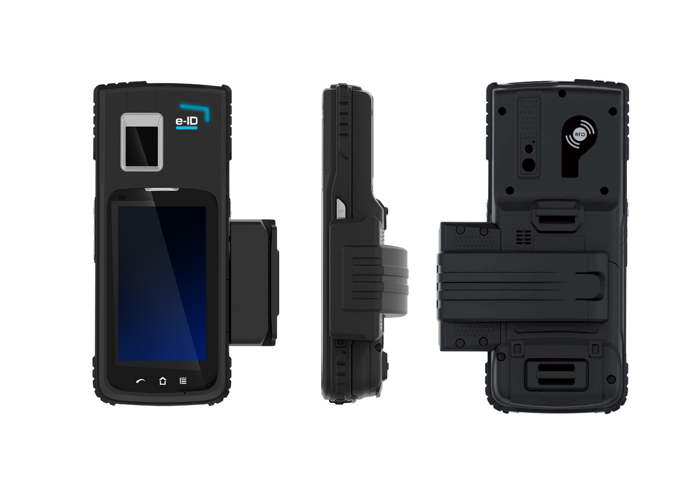
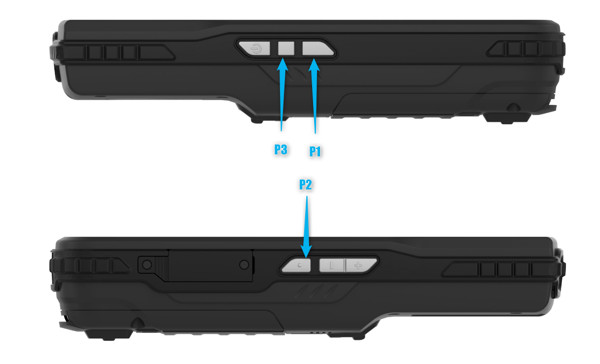

C-One² e-ID
============

Specifications
--------------

Full specifications for C-One² e-ID can be downloaded [here](https://www.coppernic.fr/en/documentations/).

Barcode Scanning
----------------

C-One² is equiped with a 2D barcode scanner. It can read both 1D and 2D symbologies:

- [Barcode](fr/barcode/manager.md)

Key mapping
-----------

C-One² has 3 programmable buttons that can be managed using API. It is possible to remap a virtual key or an application on each of them:

- [Documentation](fr/core/mapping.md)

RFID
----

- [Elyctis](fr/products/pcsc.md)

Other peripherals
------------------

- [Fingerprint](fr/products/fingerprint.md)
- [OCR](fr/products/ocr.md)
- [SAM & Smart Card](fr/products/pcsc.md)
