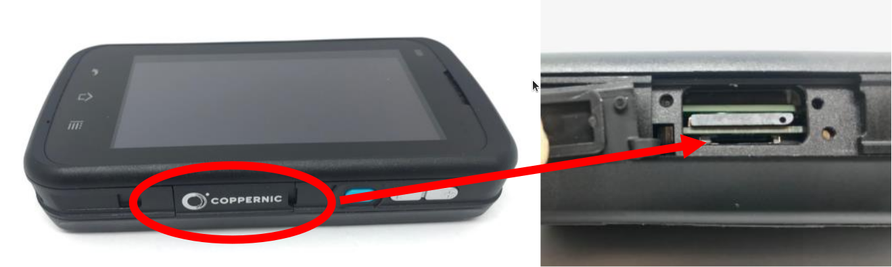
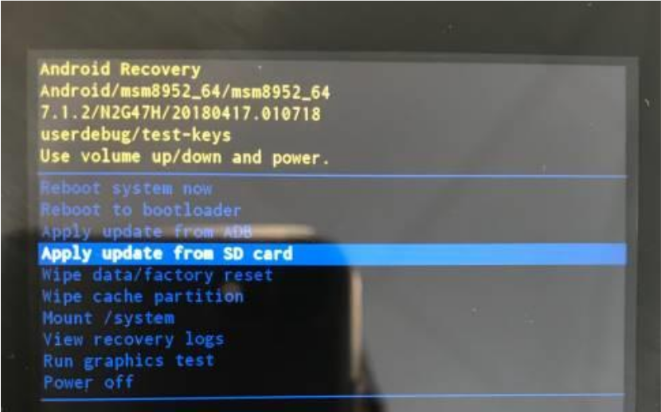
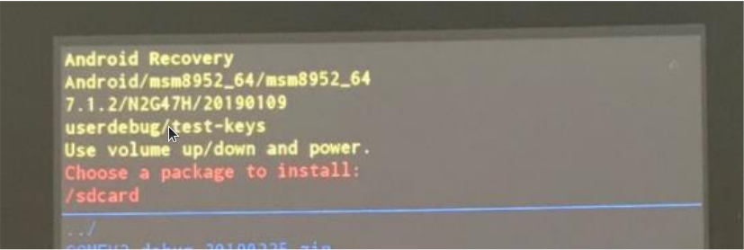
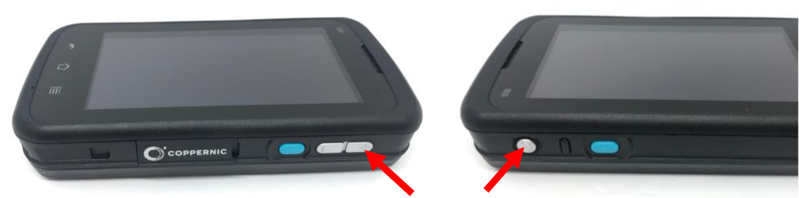
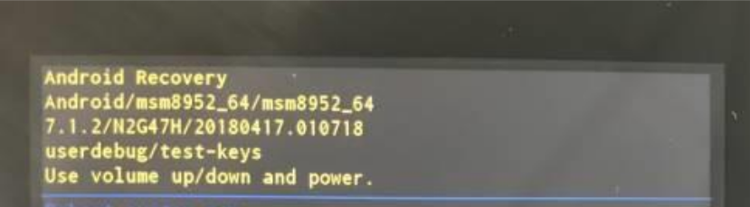
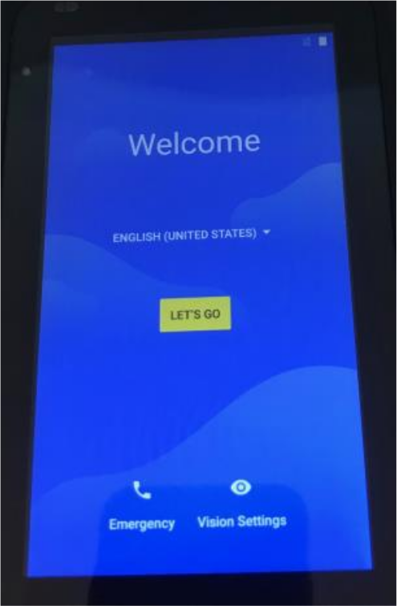

OS
==

Update procedure
----------------

To get an OS image, please contact our [support center](https://support.coppernic.fr/index.php).

Here below are procedures for upating OS on Coppernic’s devices.

### Prerequisites

* You may have adb installed on your computer, this program is not necessary when updating via micro SD card.
* You should be familiar with adb and how to install OS on Android platform.

You can find general procedure with adb sideload on [google website](https://developer.android.com/preview/download-ota).

### C-five

The following procedure explains the method to update Android in C-five handheld terminal using a micro SD card.
To realize this operation a micro SD of minimum 2 GB is necessary:

- Copy the OS update `.zip` file on a micro SD card,
- Insert the micro SD card into the device,
- Press `POWER & Vol. UP` buttons and place the battery at the same tile,
- Hold `POWER & Vol. UP` buttons until getting in the Recovery menu,
- Press `Vol. UP / DOWN` button to select “sd update” then press `POWER` button,
- Press `Vol. UP / DOWN` button to select “sd update” then press `POWER` button,
- Press `Vol. UP / DOWN` button to select the correct update `.zip` file,
- Press `POWER` button to execute the update,
- Waiting for “Install from sdcard complete” message appearance,
- Press `POWER` button to reboot the device.

### C-One

The following procedure explains the method to update Android in C-One handheld terminal using a micro SD card.
To realize this operation a micro SD of minimum 2 GB is necessary:

- Copy the OS update `.zip` file on a micro SD card,
- Insert the micro SD card into the device:

- Press `POWER` button and select “Reset”,
- Hold `P1 & Vol. UP` buttons until getting in the Recovery menu,
- Press `Vol. UP / DOWN` button to select the correct update file:

- Press `POWER` button to execute the update:

- Waiting for “Install from sdcard complete” message appearance,
- Press HW Reset button (under the SIM trapdoor).

### C-One²

The following procedure explains the method to update Android in C-One² handheld terminal using a micro SD card.
To realize this operation a micro SD of minimum 2 GB is necessary:

- Copy the OS update `.zip` file on a micro SD card,
- Switch off device,
- Insert the SD card into the device:

- Hold `POWER & Vol. UP` buttons until getting in the Recovery menu:

- Press `VOLUME +/-` button to select “Apply update from SD card” then press `POWER` button:

- Press `VOLUME +/-` button to select `update...zip` file:

- Press `POWER` button to execute the update,
- After several minutes, the following screen is displayed:

- C-One² is ready to be configured.

### ID Platform

#### OTA

This method uses OTA (Over The Air) package:

* Reboot ID Platform on Recovery mode: `adb reboot recovery`,
* On Recovery page select **adb update**,
* On your computer run `adb sideload [PACKAGE_FILE]` (Replace [PACKAGE_FILE] by the name of your package),
* When update is complete, reboot the device.

#### Fastboot

If previous method fails, try this one, it uses fastboot package:

* Unzip package for fastboot and go in unzipped folder,
* Reboot ID Platform on Fastboot mode: `adb reboot fastboot`,
* On your computer, run `flash.sh` script.
    * If you are a Windows user, then feel free to update the flash script.

Application installation
------------------------

When a new OS is installed, all user data is erased. You need to install manually
all applications.

### All devices

You can download F-Droid from here: https://coppernic.fr/fdroid.apk
Please install it on your device.

You can install other application from F-Droid then.

### C-five

- **With** barcode reader -> same apps than C-One.
- **Without** barcode reader -> nothing special.

### C-One

Here is the list of applications you need to install:

- System Services.

If you have a barcode reader:

- Barcode Settings.

### C-One², ID-Platform

- Core Services,
- F-Droid Privileged Extension.

If you have a barcode reader:

- Barcode Manager.

If you have a C-One² **Android 8** (only):

- Remapper.
